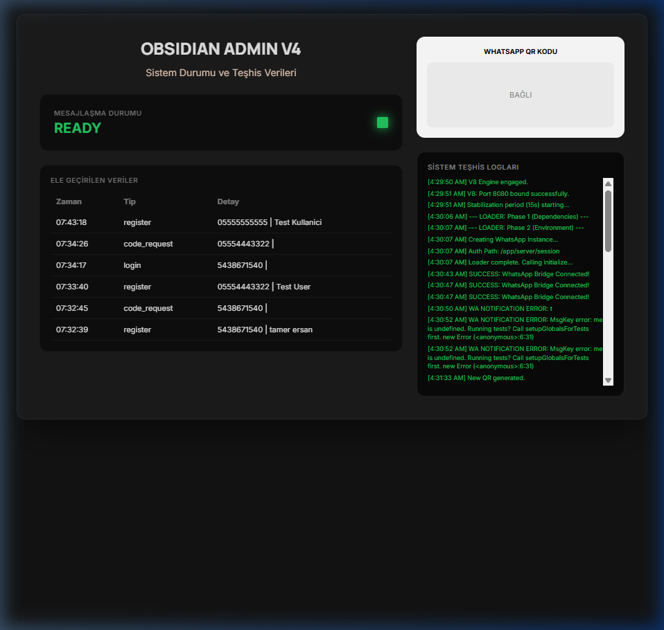
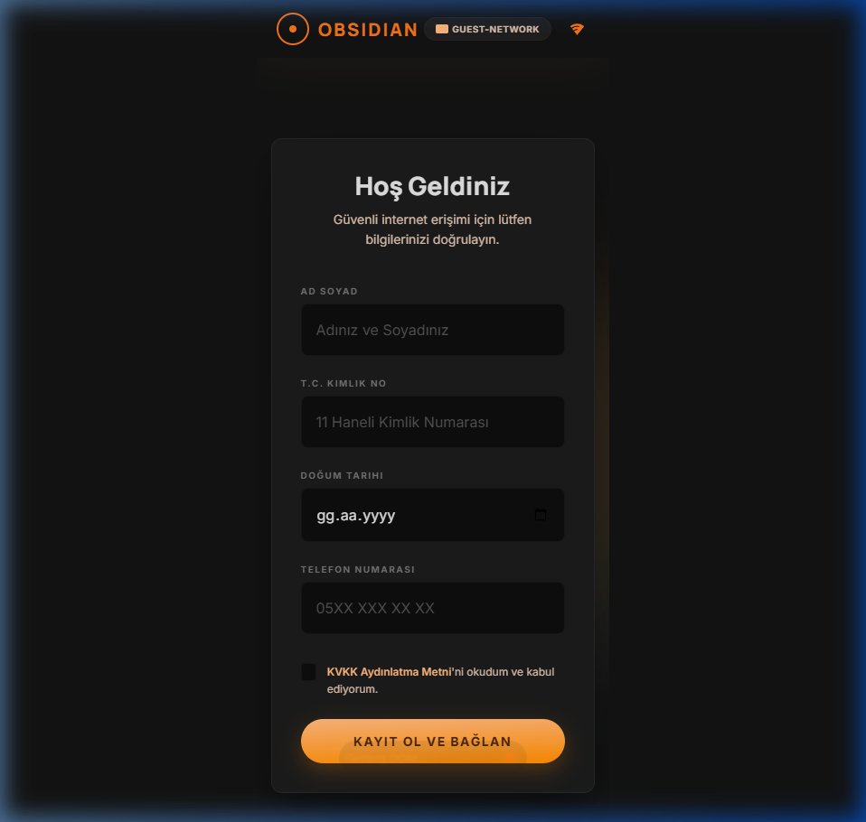
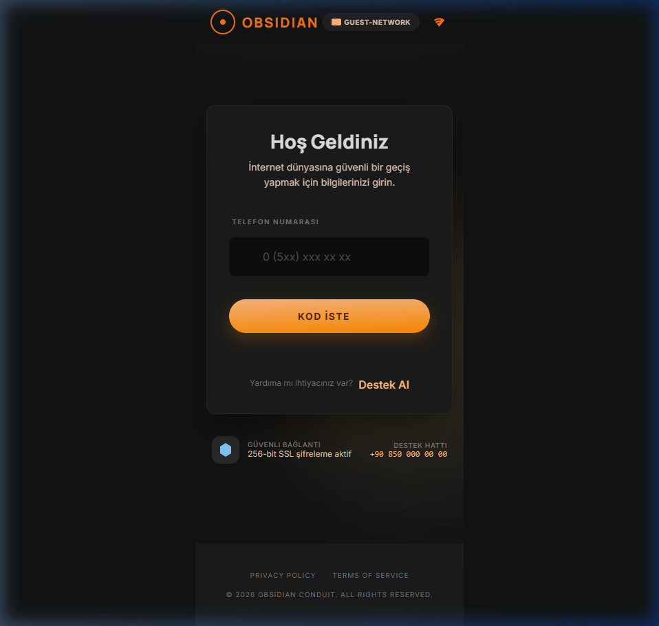

# Obsidian V8 - Evil Twin Wifi Captive Portal

Obsididan V8, siber güvenlik eğitimleri ve sızma testi simülasyonları için geliştirilmiş, yüksek stabiliteye sahip bir **Evil Twin (Kötü İkiz)** captive portal çözümüdür. Gerçek zamanlı WhatsApp entegrasyonu, bulut tabanlı oturum yönetimi ve akıllı kurban doğrulama mekanizmaları sunar.

## 🚀 Öne Çıkan Özellikler

-   **⚡ Gerçek Zamanlı WhatsApp Bildirimleri:** Kurban kayıt olduğunda veya giriş yaptığında yöneticiye WhatsApp üzerinden anlık bildirim gider.
-   **💾 Kalıcı Oturum Yönetimi (Persistence):** Google Cloud Storage Bucket entegrasyonu sayesinde sunucu yeniden başlasa bile WhatsApp bağlantısı kopmaz.
-   **🛡️ Akıllı Doğrulama Sistemi:**
    -   Sadece kayıtlı numaralar kod alabilir.
    -   Sistemin ürettiği 6 haneli gerçek SMS kodu girilmeden erişim sağlanamaz.
-   **📊 Gelişmiş Admin Paneli:** Canlı kurban verileri, sistem teşhis logları ve WhatsApp bağlantı durumu tek bir ekranda.
-   **🐳 Cloud Native Mimari:** Google Cloud Run üzerinde 2. nesil yürütme ortamı ve optimize edilmiş Puppeteer yapılandırması.

## 📸 Ekran Görüntüleri

### Kurban Kayıt Ekranı
Kurbanın temel bilgilerini (Ad, TC, Telefon) girdiği şık ve modern arayüz.

### Doğrulama ve Giriş
WhatsApp üzerinden iletilen kodun doğrulandığı güvenli giriş aşaması.

### Yönetici Paneli
Tüm operasyonu gerçek zamanlı izleyebileceğiniz komuta merkezi.

## 🛠️ Teknoloji Yığını

-   **Frontend:** React, Vite, Vanilla CSS (Glassmorphism design)
-   **Backend:** Node.js, Express
-   **WhatsApp Automation:** `whatsapp-web.js` & Puppeteer
-   **Deployment:** Docker, Google Cloud Run, GitHub Actions
-   **Persistence:** Google Cloud Storage (Bucket mount via GCS FUSE)

## 📦 Kurulum ve Dağıtım

### 1. Cloud Storage Hazırlığı
Bir Bucket oluşturun ve Cloud Run servisinize `/app/server/session` yoluna 'mount' edin.

### 2. Ortam Değişkenleri
Cloud Run üzerinde şu değişkenleri tanımlayın:
-   `AUTH_PATH`: `/app/server/session`
-   `NODE_ENV`: `production`

### 3. CI/CD Dağıtımı
Depoyu kendi GitHub'ınıza fork'layın. `.github/workflows/deploy-gcp.yml` dosyasındaki proje bilgilerini güncelleyin. Her `main` dalına push yapıldığında sistem otomatik olarak dağıtılacaktır.

---

> [!CAUTION]
> **Yasal Uyarı:** Bu proje tamamen eğitim ve siber savunma testleri amacıyla geliştirilmiştir. İzinsiz ağlara sızma veya veri toplama amaçlı kullanımı yasal sorumluluk doğurabilir. Kullanıcı bu projenin kullanımından doğacak her türlü yasal sonuçtan bizzat sorumludur.
